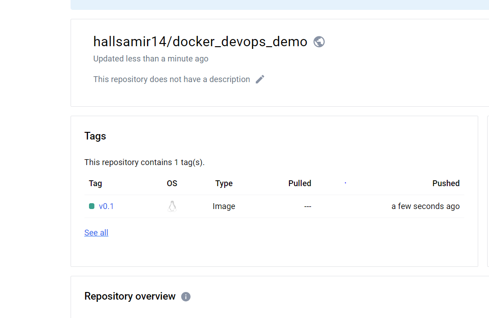

# Devops - Automated Builds Pushing to Dockeruhub Intro

To automate Docker builds and pushing to Docker Hub, you can use a CI/CD tool like GitHub Actions. Here's an example of a GitHub Actions workflow that builds a Docker image and pushes it to Docker Hub:

1. Create a Kubernetes CronJob that runs the Kaniko build. The Kaniko build is a tool that allows you to build Docker images in a Kubernetes cluster without needing to run a Docker daemon in the cluster.
2. Create a Kubernetes secret that contains your Docker Hub credentials. This secret will be used by the Kaniko build to authenticate with Docker Hub.
3. Create a GitHub Actions workflow that runs on a schedule (e.g. daily, weekly, etc.).
4. In the GitHub Actions workflow, check out the code from your repository.
5. Use the docker/build-push-action action to build and push the Docker image to Docker Hub. You can specify the Dockerfile location, Docker Hub repository, and any build arguments that you need.
6. Optionally, you can add additional steps to your GitHub Actions workflow to run tests, lint your code, or perform other tasks before building the Docker image.

